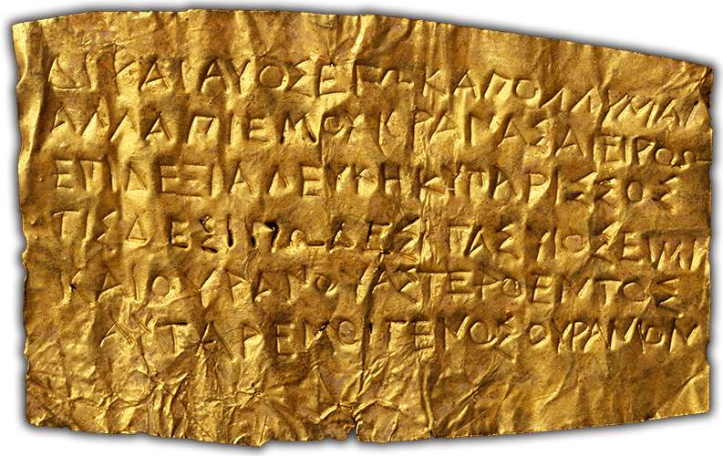

# Underworld Lamella

This project was built for the *Underworld: Imagining the Afterlife* exhibition at the Getty Villa.

---
Named after the mythical poet Orpheus, Orphic tablets are inscriptions written on thin sheets of gold that were buried with the dead. The ancient Greeks believed that one means to a good afterlife was through initiation into a mystery cult. An Orphic tablet vouched for an initiate’s privileged status upon death, and its inscription was meant to be recited for entry into the underworld. Its text might reference landmarks along the journey, such as a spring, a cypress tree, or the Lake of Memory.



To learn more about orphic tablets visit [getty.edu](http://www.getty.edu/art/collection/objects/7194/unknown-maker-lamella-orphica-greek-second-half-of-4th-century-bc/).

---


## Project setup
```bash
# install
npm install

# dev
npm run serve

# build
npm run build:[env]
```

There are 3 build scripts, 1 for each of the environments the project will live in. The build process is the same, only using different `.env` files to set system variables.
```bash
build:ipad  # this will build with a target deployment on iPads in gallery
build:heart # build for the staging server
build:web   # build for the production web version
```

